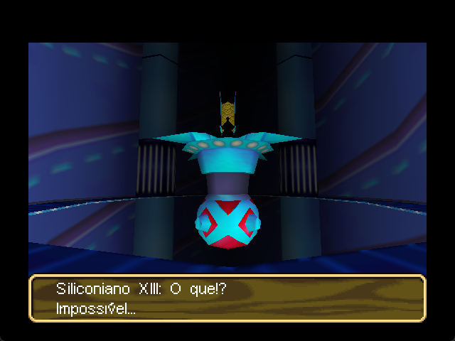

# Wonder Project J2 — Static Recompilation

Static recompilation of **Wonder Project J2: Koruro no Mori no Jozet**
(Nintendo 64, 1998) into native C, with a runtime that replaces the N64
hardware instead of emulating it.

Recompilação estática de **Wonder Project J2: Koruro no Mori no Jozet**
(Nintendo 64, 1998) para C nativo, com um runtime que substitui o hardware do
N64 em vez de emulá-lo.

| | | |
|---|---|---|
|  |  |  |
| Opening / Abertura | Title / Título | 3D corridor / Corredor 3D |

*Frames rendered by the software rasterizer in this repository.*
*Quadros renderizados pelo rasterizador em software deste repositório.*

---

## What this is / O que é

**EN** — This is not an emulator. The game's MIPS code is translated to C
ahead of time by [N64Recomp](https://github.com/N64Recomp/N64Recomp), and the
libultra calls it makes (threads, DMA, RSP tasks, video, audio, controller)
are answered by a runtime written from scratch in this repository. The RSP
graphics and audio microcode are interpreted in C; the RDP is rasterized in
software.

The project is developed by measurement, not by guesswork. Every claim in the
documentation is backed by an experiment, and hypotheses that failed are kept
on record with the reason — so nobody pays for them twice.

**PT** — Isto não é um emulador. O código MIPS do jogo é traduzido para C
antecipadamente pelo [N64Recomp](https://github.com/N64Recomp/N64Recomp), e as
chamadas de libultra que ele faz (threads, DMA, tarefas de RSP, vídeo, áudio,
controle) são atendidas por um runtime escrito do zero neste repositório. O
microcódigo de RSP para gráficos e áudio é interpretado em C; o RDP é
rasterizado em software.

O projeto é conduzido por medição, não por suposição. Toda afirmação na
documentação tem um experimento por trás, e as hipóteses que falharam ficam
registradas com o motivo — para ninguém pagar por elas duas vezes.

---

## Progress / Evolução

> Only Phase 1 is being scored. Work belonging to later phases may already be
> underway (the PT-BR translation, for example), but their percentages stay at
> zero until Phase 1 closes.
>
> Só a Fase 1 é pontuada. Trabalho de fases posteriores pode já estar em
> andamento (a tradução PT-BR, por exemplo), mas as porcentagens ficam zeradas
> até a Fase 1 fechar.

### Phase 1 — Working prototype / Protótipo funcional — `96%`

`███████████████████░` 96%

**EN** — Get the game running end to end, however rough. Boot, threads,
scheduler, DMA, display lists, rasterizer, audio synthesis, input.

**PT** — Colocar o jogo rodando de ponta a ponta, ainda que tosco. Boot,
threads, escalonador, DMA, listas de exibição, rasterizador, síntese de áudio,
entrada.

| | |
|---|---|
| Boot and libultra core | ✅ |
| Thread scheduler (Windows fibers) | ✅ |
| PI / SI / SP / DP / VI / AI | ✅ |
| F3DEX display lists, RDP rasterizer | ✅ |
| Audio synthesis (ABI1) | ⚠️ audible hiss under investigation |
| Controller input | ⚠️ reaches the PIF, game stops polling |

### Phase 2 — Execution fidelity / Fidelidade de execução — `0%`

`░░░░░░░░░░░░░░░░░░░░` 0%

**EN** — Make it behave like the original: correct materials, transitions,
timing, and audio that matches the hardware.

**PT** — Fazer executar como o original: materiais corretos, transições,
temporização e áudio igual ao do hardware.

### Phase 3 — Full extraction / Extração total — `0%`

`░░░░░░░░░░░░░░░░░░░░` 0%

**EN** — Replace the recompiled blob with fully understood native code and
extracted assets. No opaque regions left.

**PT** — Substituir o bloco recompilado por código nativo compreendido e
recursos extraídos. Sem regiões opacas.

### Phase 4 — Platform modernization / Modernização — `0%`

`░░░░░░░░░░░░░░░░░░░░` 0%

**EN** — Widescreen and ultrawide, GPU backend, higher-resolution textures and
sprites, translations.

**PT** — Widescreen e ultrawide, backend de GPU, texturas e sprites em
resolução maior, traduções.

---

## Requirements / Requisitos

**EN** — You must supply your own copy of the ROM. Nothing derived from it is
distributed here: no ROM, no recompiled output, no extracted text, palettes or
textures.

**PT** — Você precisa fornecer sua própria cópia da ROM. Nada derivado dela é
distribuído aqui: nem ROM, nem saída do recompilador, nem textos, paletas ou
texturas extraídos.

- Windows, Visual Studio 2022 (Build Tools are enough)
- Python 3
- [N64Recomp](https://github.com/N64Recomp/N64Recomp) — generates the C from
  the ROM

---

## Building / Compilando

```bat
:: 1. Configure paths (ROM, MSVC, Python)
tools\env.cmd

:: 2. Generate the recompiled C from your ROM, then build
tools\build_probe.cmd

:: 3. Run the current test profile with a window and keyboard
TESTAR.bat
```

### Keyboard / Teclado

| Key | N64 |
|---|---|
| Enter | START |
| X / Space | A |
| Z | B |
| C | Z trigger |
| A / S | L / R |
| Arrows | D-Pad |

`F5` frame capture · `F6` history · `F2`/`F4` checkpoint · `F11` cycle audio voice

---

## Layout / Estrutura

| Path | |
|---|---|
| `runtime/` | The runtime: scheduler, HLE, RSP/RDP, audio, video, PIF |
| `src/` | Project-owned scripts, tests, generated recompilation sources and build configuration |
| `textos/` | Local, ROM-derived text catalogs; intentionally ignored by Git |
| `analise/` | Consolidated, already-reviewed findings split by project/oracle origin |
| `temp/` | Disposable output from the next test; it is consumed, consolidated and cleaned |
| `tools/` | Build scripts and third-party reference projects |
| `TESTAR.bat` | Main entry point for interactive and diagnostic tests |
| `*.md` | Investigation records — see below |

### Documentation / Documentação

| File | |
|---|---|
| `RELATORIO_DECOMPILACAO.md` | Canonical status |
| `ANALISE_AUDIO.md` | Audio investigation: what is proven, what was ruled out |
| `ENTRADA_RETOMADA.md` | Controller input investigation |
| `PENDENCIAS.md` | Known visual fidelity gaps |
| `PLANEJAMENTO.md` | Planning |

**EN** — The analysis documents are unusual on purpose: they record failed
hypotheses and the measurements that killed them, plus the method traps
already paid for. Read them before changing audio or input code — some of it
looks wrong and is deliberately that way, with the measurement to prove it.

**PT** — Os documentos de análise são incomuns de propósito: registram
hipóteses fracassadas e as medições que as mataram, além das armadilhas de
método já pagas. Leia antes de mexer em áudio ou entrada — parte do código
parece errada e está assim deliberadamente, com a medição que comprova.

---

## References / Referências

Used as tooling and reference. **Not vendored in this repository** — clone
them separately if you need them.

Usados como ferramenta e referência. **Não versionados aqui** — clone
separadamente se precisar.

| Project | Use |
|---|---|
| [N64Recomp](https://github.com/N64Recomp/N64Recomp) | MIPS → C static recompiler. Required to build. |
| [N64ModernRuntime](https://github.com/N64Recomp/N64ModernRuntime) | Reference runtime (`librecomp` / `ultramodern`). Our native libultra replacements follow its model. |
| [Zelda64Recomp](https://github.com/Zelda64Recomp/Zelda64Recomp) | Reference for how a working recompilation wires input and video. |
| [Project64](https://github.com/project64/project64) | Emulator, used as a behavioural oracle for graphics and audio comparisons. |
| [wonder](https://github.com/LLONSIT-glitch/wonder) | Wonder Project J2 decompilation reference used to confirm game functions and improve text, audio, graphics and input mappings. |
| [libreultra](https://github.com/n64decomp/libreultra) | Open libultra implementation used as an API and behaviour reference. |
| [sdk-tools](https://github.com/n64decomp/sdk-tools) | Nintendo 64 SDK analysis tools used as an additional decompilation reference. |

---

## Method / Método

**EN** — Two ideas drive the work:

1. **The real microcode is the oracle.** The ROM's own RSP microcode is
   recompiled and executed alongside our C implementation on the same audio
   lists; a bisection finds the first command where they diverge. HLE
   emulators are approximations and were shown to disagree with the hardware.
2. **Measure before concluding.** Instrument noise is measured, not assumed,
   so improvements are not confused with run-to-run variation.

**PT** — Duas ideias conduzem o trabalho:

1. **O microcódigo real é o oráculo.** O microcódigo de RSP da própria ROM é
   recompilado e executado ao lado da nossa implementação em C sobre as mesmas
   listas de áudio; uma bisseção encontra o primeiro comando em que divergem.
   Emuladores HLE são aproximações e se mostraram discordantes do hardware.
2. **Medir antes de concluir.** O ruído do instrumento é medido, não presumido,
   para que melhora não seja confundida com variação entre execuções.

---

## Legal

**EN** — This repository contains only original code and tooling. It does not
contain, and will not accept, the ROM or any data extracted from it. You need
your own legally obtained copy of the game to build and run anything here.

**PT** — Este repositório contém apenas código e ferramentas originais. Não
contém, e não aceitará, a ROM nem dados extraídos dela. Você precisa da sua
própria cópia legalmente obtida do jogo para compilar e executar qualquer
coisa aqui.

Wonder Project J2 is © Enix / Givro. This project is not affiliated with or
endorsed by the rights holders.
